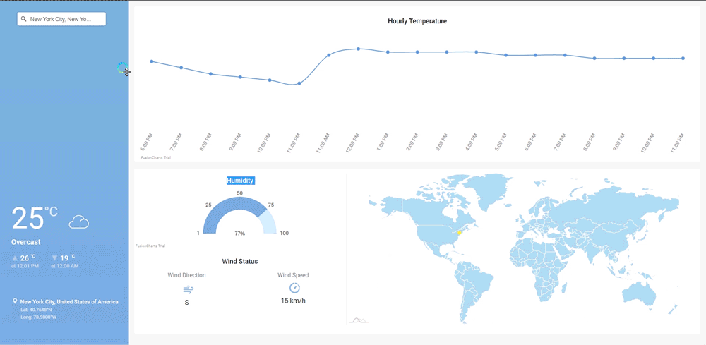

# Dynamic Weather Dashboard

> The dashboard is a Vue.js project which integrates [Fusioncharts](https://www.fusioncharts.com/) and [Amcharts4](https://www.amcharts.com/docs/v4/) elements

The application is based on this [article](https://www.smashingmagazine.com/2019/02/interactive-weather-dashboard-api-vue-js/),
with the following additions:
* Process user's goelocation (instead of a predefined  location)
* Using Mapbox's geocoder
* Displays current location on a  map (an amchart4's component)
* Weather icons
* Humidity data
* Layout update




## Build Setup

``` bash
# install dependencies
npm install

# serve with hot reload at localhost:8080
npm run dev

# build for production with minification
npm run build
```
